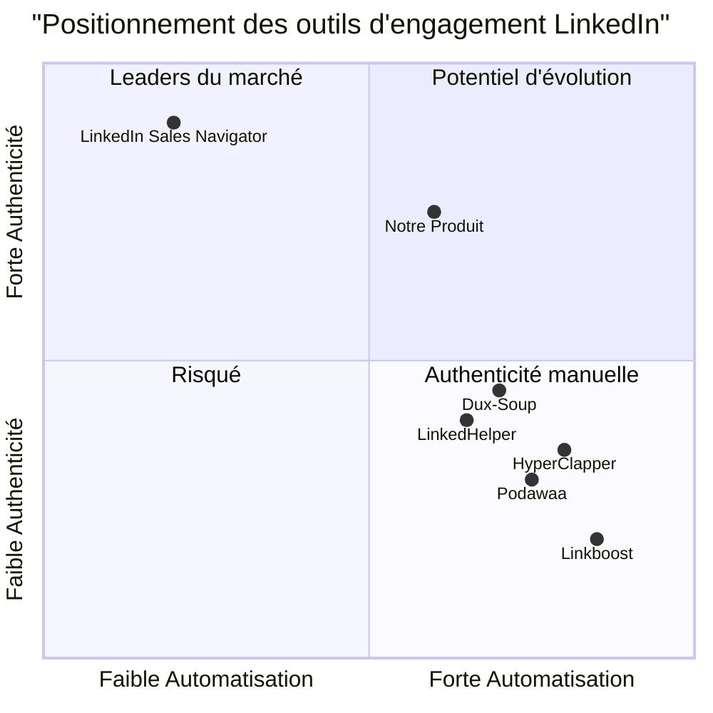

# Document de Spécification des Exigences du Produit (PRD)
# LinkedIn Community Booster – AI Edition

## Informations du Projet
- **Nom du Projet**: LinkedIn Community Booster – AI Edition
- **Date de Création**: 31 Juillet 2025
- **Auteur**: Emma, Product Manager

## Reformulation des Exigences Initiales

L'application LinkedIn Community Booster – AI Edition est une solution conçue pour aider les professionnels à augmenter leur engagement sur LinkedIn grâce à l'intelligence artificielle. L'application permet aux utilisateurs de générer des commentaires pertinents pour les publications LinkedIn, de gérer leur activité d'engagement et de maintenir des relations avec leur communauté professionnelle.

L'application comprend quatre écrans principaux:
1. Accueil - Vue d'ensemble des statistiques et navigation principale
2. Ajouter un post - Génération de commentaires IA pour une publication spécifique
3. Explorer des posts - Découverte de publications à commenter
4. Ma communauté - Gestion des relations avec les contacts fréquents

La structure de base de données inclut trois tables: Posts (pour stocker les publications et commentaires), Agents (pour gérer les identités d'engagement), et Communauté (pour suivre les relations avec d'autres professionnels).

## Définition du Produit

### Objectifs du Produit

1. **Optimisation de l'Engagement**: Permettre aux utilisateurs d'augmenter significativement leur présence sur LinkedIn en générant des commentaires professionnels et pertinents sur les publications de leur réseau.

2. **Gestion de la Communauté**: Fournir un système pour suivre et maintenir des relations professionnelles de manière organisée et efficace.

3. **Automatisation Éthique**: Offrir des outils d'automatisation qui respectent les politiques de LinkedIn et maintiennent l'authenticité des interactions professionnelles.

### User Stories

1. **En tant que** professionnel actif sur LinkedIn, **je veux** générer des commentaires pertinents pour les publications de mon réseau **afin de** maintenir une présence visible sans y consacrer des heures chaque jour.

2. **En tant que** responsable marketing d'une entreprise, **je veux** identifier et engager des discussions sur les publications pertinentes de mon secteur **afin d'** augmenter la visibilité de ma marque et établir une autorité dans mon domaine.

3. **En tant qu'** entrepreneur en recherche de partenariats, **je veux** maintenir des relations avec mes contacts les plus importants **afin de** cultiver un réseau professionnel solide qui soutient mes objectifs commerciaux.

4. **En tant que** demandeur d'emploi, **je veux** rester actif et visible auprès des recruteurs et décideurs de mon secteur **afin d'** améliorer mes chances de découvrir et d'obtenir des opportunités professionnelles.

5. **En tant qu'** expert dans mon domaine, **je veux** participer aux conversations pertinentes de mon industrie **afin de** renforcer ma réputation et mon personal branding.

### Analyse Concurrentielle

| Produit | Avantages | Inconvénients |
|---------|-----------|---------------|
| HyperClapper | - Interface intuitive - Bonnes capacités de ciblage d'audience - Analyses détaillées - Automatisation avancée | - Prix élevé - Risques de violation des conditions d'utilisation - Parfois perçu comme non authentique - Courbe d'apprentissage importante |
| Podawaa | - Spécialisé dans l'automatisation - Facile à configurer - Prix compétitifs - Bonne intégration avec LinkedIn | - Fonctionnalités limitées - Peu d'options de personnalisation - Support client limité - Problèmes de fiabilité |
| Linkboost | - Focus sur les likes et commentaires - Interface simple - Bon rapport qualité-prix - Démarrage rapide | - Manque d'analyses avancées - Personnalisation limitée - Risque élevé de détection - Peu évolutif |
| Dux-Soup | - Outil établi et fiable - Nombreuses intégrations - Bonnes capacités de prospection - Grande communauté d'utilisateurs | - Interface utilisateur vieillissante - Fonctionnalités d'IA limitées - Installation technique requise - Axé sur la quantité plutôt que la qualité |
| LinkedHelper | - Suite complète d'outils - Possibilités d'automatisation avancées - Bonne réputation - Fonctionnalités CRM intégrées | - Complexe pour les débutants - Prix élevé pour toutes les fonctionnalités - Parfois instable après mises à jour LinkedIn - Risque modéré de restrictions de compte |
| LinkedIn Sales Navigator | - Officiellement approuvé par LinkedIn - Données de haute qualité - Aucun risque de violation des conditions - Intégrations natives | - Pas d'automatisation de commentaires - Très coûteux - Fonctionnalités limitées d'engagement - Nécessite un travail manuel important |
| Notre Produit | - Génération de commentaires IA personnalisés - Respect des conditions d'utilisation LinkedIn - Focus sur l'authenticité - Gestion complète de la communauté | - Nouveau sur le marché - Fonctionnalités d'automatisation limitées - Pas encore d'intégration directe avec l'API LinkedIn - Base d'utilisateurs en développement |

### Diagramme en Quadrant Comparatif

## Spécifications Techniques

### Analyse des Exigences

LinkedIn Community Booster est conçu pour équilibrer l'automatisation et l'authenticité dans l'engagement LinkedIn. L'application permet aux utilisateurs de générer des commentaires IA pertinents et professionnels pour les publications LinkedIn, tout en maintenant un contrôle humain sur leur déploiement. Cette approche "assistée par IA" plutôt que "entièrement automatisée" respecte les conditions d'utilisation de LinkedIn tout en offrant des gains d'efficacité significatifs.

L'application nécessite:
- Une interface intuitive pour la génération et la gestion des commentaires
- Une connexion à des API d'IA pour générer du contenu personnalisé
- Un système de stockage pour les publications et commentaires
- Des capacités de gestion des relations avec la communauté
- Une visualisation des statistiques d'engagement

### Pool d'Exigences

#### P0 (Must-have)
1. Permettre aux utilisateurs d'entrer une URL de publication LinkedIn
2. Générer 3 commentaires différents à l'aide d'IA pour une publication donnée
3. Afficher clairement les commentaires générés avec options de sélection
4. Stocker l'historique des publications et commentaires générés
5. Interface utilisateur intuitive et réactive
6. Tableau de bord des statistiques de base (nombre de posts, commentaires)
7. Système de gestion des publications récentes

#### P1 (Should-have)
1. Explorer les publications populaires dans le réseau de l'utilisateur
2. Personnaliser les personas des commentaires générés
3. Système de suivi de la communauté avec contacts fréquents
4. Affichage des métriques d'engagement avancées
5. Notifications pour les nouvelles publications pertinentes
6. Historique complet des interactions passées
7. Filtres pour les types de publications à cibler

#### P2 (Nice-to-have)
1. Intégration directe avec l'API LinkedIn (si autorisé)
2. Calendrier de planification des commentaires
3. Suggestions de contacts à engager basées sur l'activité récente
4. Analyse de sentiment des publications pour commentaires mieux ciblés
5. Système de tags pour catégoriser les contacts et publications
6. Rapports exportables des activités d'engagement
7. Mode "équipe" pour collaboration entre plusieurs utilisateurs

### Ébauche de Design UI

#### 1. Écran d'Accueil
- En-tête avec logo et navigation principale
- Section statistiques avec trois cartes principales:
  * Nombre total de posts boostés (avec graphique d'évolution)
  * Nombre total de commentaires générés
  * Taux d'engagement moyen (avec comparaison période précédente)
- Trois boutons d'action principaux:
  * "Ajouter un post" (bouton primaire, plus grand)
  * "Explorer des posts"
  * "Voir ma communauté"
- Section "Activité récente" montrant les dernières actions
- Footer avec informations légales et support

#### 2. Écran Ajouter un post
- Champ de saisie pour l'URL de la publication LinkedIn
- Bouton "Analyser le contenu" qui extrait le contenu de la publication
- Affichage du contenu extrait avec possibilité de modification
- Bouton "Générer commentaires IA"
- Section de résultats avec trois cartes de commentaires:
  * Chaque carte identifiée par le persona (Tech-savvy, Recruiter, Peer)
  * Texte du commentaire généré
  * Options: "Modifier", "Copier", "Publier"
- Bouton "Booster maintenant" (pour publier le commentaire sélectionné)
- Option pour revenir à l'accueil ou explorer d'autres posts

#### 3. Écran Explorer des posts
- Filtres de recherche (date, popularité, secteur)
- Liste de publications pertinentes avec:
  * Aperçu du contenu
  * Métriques d'engagement actuelles
  * Potentiel d'impact estimé
  * Bouton "Générer commentaire IA"
  * Bouton "Commenter maintenant"
- Pagination ou chargement infini
- Option de rafraîchissement des résultats

#### 4. Écran Ma communauté
- Tableau de bord de l'engagement communautaire
- Liste de profils avec:
  * Photo et nom
  * Fréquence d'interaction
  * Dernière interaction
  * Statut de la relation
  * Bouton "Relancer discussion"
- Section "Derniers posts commentés"
- Statistiques d'engagement par contact
- Suggestions de nouveaux contacts à engager

### Questions Ouvertes

1. **Conformité LinkedIn**: Comment l'application peut-elle s'assurer de respecter pleinement les conditions d'utilisation de LinkedIn, particulièrement concernant l'automatisation? Devons-nous implémenter des limites quotidiennes?

2. **Extraction de Contenu**: Quelle est la meilleure méthode pour extraire le contenu d'une publication LinkedIn à partir de son URL sans violer les conditions d'utilisation?

3. **Personnalisation AI**: Dans quelle mesure les utilisateurs devraient-ils pouvoir personnaliser les personas et les styles des commentaires générés?

4. **Intégration API**: Devrions-nous explorer l'utilisation de l'API officielle de LinkedIn, malgré ses limitations, ou utiliser des méthodes alternatives?

5. **Modèle de Monétisation**: Quel modèle de revenus serait le plus approprié? Freemium, abonnement mensuel, ou paiement à l'utilisation?

6. **Mesures Anti-Détection**: Quelles mesures devrions-nous implémenter pour éviter que LinkedIn identifie les commentaires comme générés par IA?

7. **Éthique de l'Automatisation**: Comment équilibrer les avantages de l'automatisation avec la nécessité de maintenir des interactions authentiques et significatives?

## Spécifications de l'Architecture Technique

### Structure de la Base de Données

#### Table: Posts
| Champ | Type | Description |
|-------|------|-------------|
| id | UUID | Identifiant unique du post |
| post_url | VARCHAR(255) | URL de la publication LinkedIn |
| post_content | TEXT | Contenu extrait de la publication |
| date_added | TIMESTAMP | Date d'ajout à la base de données |
| comment_1 | TEXT | Premier commentaire généré (Tech-savvy) |
| comment_2 | TEXT | Deuxième commentaire généré (Recruiter) |
| comment_3 | TEXT | Troisième commentaire généré (Peer) |
| selected_comment | INTEGER | Index du commentaire sélectionné (1-3) |
| status | ENUM | Statut du post: 'pending', 'commented', 'skipped' |
| engagement_metrics | JSON | Métriques d'engagement (likes, comments, etc.) |
| user_id | UUID | Référence à l'utilisateur |

#### Table: Agents
| Champ | Type | Description |
|-------|------|-------------|
| id | UUID | Identifiant unique de l'agent |
| agent_name | VARCHAR(100) | Nom de l'agent/persona |
| email | VARCHAR(255) | Email associé (optionnel) |
| ip_proxy | VARCHAR(255) | Adresse IP du proxy (si utilisé) |
| last_activity | TIMESTAMP | Dernière utilisation |
| daily_comment_count | INTEGER | Nombre de commentaires aujourd'hui |
| daily_limit | INTEGER | Limite quotidienne de commentaires |
| user_id | UUID | Référence à l'utilisateur |

#### Table: Communauté
| Champ | Type | Description |
|-------|------|-------------|
| id | UUID | Identifiant unique du contact |
| name | VARCHAR(100) | Nom du contact |
| linkedin_url | VARCHAR(255) | URL du profil LinkedIn |
| interactions | INTEGER | Nombre d'interactions totales |
| recent_post | VARCHAR(255) | URL de la publication la plus récente |
| last_interaction_date | TIMESTAMP | Date de la dernière interaction |
| engagement_score | FLOAT | Score d'engagement calculé |
| notes | TEXT | Notes personnelles sur le contact |
| category | VARCHAR(50) | Catégorie du contact |
| user_id | UUID | Référence à l'utilisateur |

#### Table: Users
| Champ | Type | Description |
|-------|------|-------------|
| id | UUID | Identifiant unique de l'utilisateur |
| email | VARCHAR(255) | Email de l'utilisateur |
| password_hash | VARCHAR(255) | Hash du mot de passe |
| name | VARCHAR(100) | Nom complet |
| created_at | TIMESTAMP | Date de création du compte |
| last_login | TIMESTAMP | Dernière connexion |
| subscription_status | ENUM | Statut d'abonnement |
| settings | JSON | Préférences utilisateur |

#### Table: Analytics
| Champ | Type | Description |
|-------|------|-------------|
| id | UUID | Identifiant unique |
| user_id | UUID | Référence à l'utilisateur |
| date | DATE | Date de l'analyse |
| posts_boosted | INTEGER | Nombre de posts boostés |
| comments_generated | INTEGER | Nombre de commentaires générés |
| avg_engagement_rate | FLOAT | Taux d'engagement moyen |
| top_performing_comment | TEXT | Commentaire le plus performant |
| metrics | JSON | Métriques détaillées |

### Workflow Technique

1. **Ajout d'un Post**
   - L'utilisateur entre l'URL de la publication LinkedIn
   - Le système extrait le contenu de la publication (via web scraping ou API)
   - Le contenu est analysé pour déterminer le contexte et le sujet
   - L'API d'IA génère 3 commentaires personnalisés
   - Les commentaires sont présentés à l'utilisateur pour sélection
   - Le commentaire sélectionné peut être publié manuellement ou via webhook

2. **Exploration des Posts**
   - Le système analyse le réseau de l'utilisateur pour identifier les publications pertinentes
   - Les publications sont classées par potentiel d'engagement
   - L'utilisateur peut filtrer les résultats selon divers critères
   - Pour chaque publication, l'utilisateur peut générer des commentaires personnalisés
   - Les interactions sont suivies pour améliorer les recommandations futures

3. **Gestion de la Communauté**
   - Le système suit les interactions de l'utilisateur avec ses contacts
   - Les contacts fréquents sont identifiés et priorisés
   - L'application suggère des moments pour relancer les discussions
   - Les statistiques d'engagement sont calculées pour chaque contact
   - Des recommandations pour améliorer les relations sont fournies

### Considérations de Sécurité et Conformité

1. **Respect des Conditions d'Utilisation de LinkedIn**
   - Implémentation de limites quotidiennes d'interactions
   - Évitement des comportements de spam ou d'automatisation excessive
   - Contrôle humain obligatoire pour les actions critiques

2. **Protection des Données**
   - Chiffrement des données sensibles
   - Conformité RGPD pour les utilisateurs européens
   - Politique claire de conservation et suppression des données

3. **Authentification et Autorisation**
   - Authentification multi-facteurs
   - Système de permissions granulaire
   - Journalisation des activités sensibles

## Planification et Roadmap

### Phase 1: MVP (Minimum Viable Product)
- Implémentation des fonctionnalités P0
- Focus sur la génération de commentaires IA et la gestion basique des posts
- Interface utilisateur simple mais fonctionnelle
- Système de base de données essentiel

### Phase 2: Expansion des Fonctionnalités
- Ajout des fonctionnalités P1
- Amélioration de l'expérience utilisateur
- Développement des capacités d'analyse
- Expansion de la gestion de la communauté

### Phase 3: Fonctionnalités Avancées
- Implémentation des éléments P2
- Intégrations avancées (si possible avec API LinkedIn)
- Capacités d'analyse prédictive
- Fonctionnalités collaboratives

## Métriques de Succès

1. **Engagement Utilisateur**
   - Taux de rétention après 30 jours > 40%
   - Utilisation hebdomadaire active > 3 sessions
   - Durée moyenne de session > 5 minutes

2. **Performance Produit**
   - Taux de commentaires générés et utilisés > 60%
   - Augmentation mesurable de l'engagement LinkedIn des utilisateurs
   - Nombre moyen de contacts activement gérés > 15

3. **Satisfaction Utilisateur**
   - NPS (Net Promoter Score) > 30
   - Taux de conversion des essais gratuits > 15%
   - Taux de satisfaction utilisateur > 4/5

## Conclusion

LinkedIn Community Booster – AI Edition représente une approche équilibrée entre l'automatisation et l'authenticité pour l'engagement sur LinkedIn. En fournissant des commentaires générés par IA mais contrôlés par l'humain, l'application permet aux utilisateurs d'améliorer significativement leur présence sur LinkedIn tout en maintenant des interactions authentiques et professionnelles.

Le produit répond à un besoin croissant de solutions d'engagement efficaces mais éthiques dans l'écosystème LinkedIn, où les outils purement automatisés font face à des restrictions croissantes. En mettant l'accent sur la qualité des interactions plutôt que sur la quantité, LinkedIn Community Booster se positionne dans un segment de marché en croissance avec un potentiel significatif de développement.